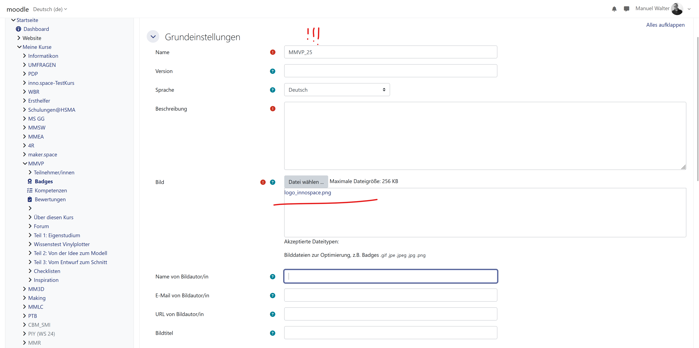
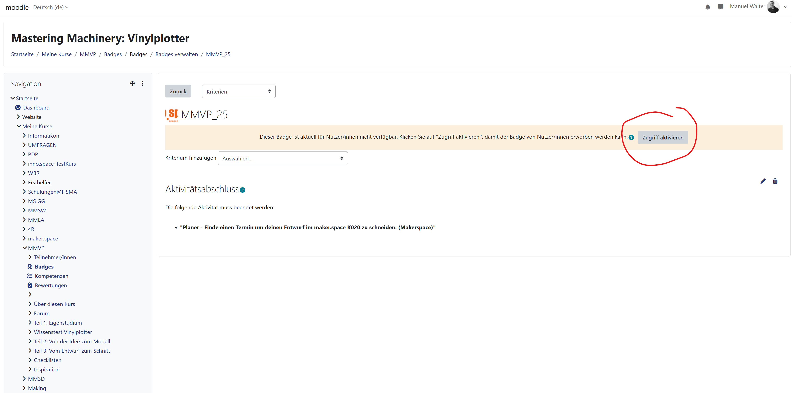
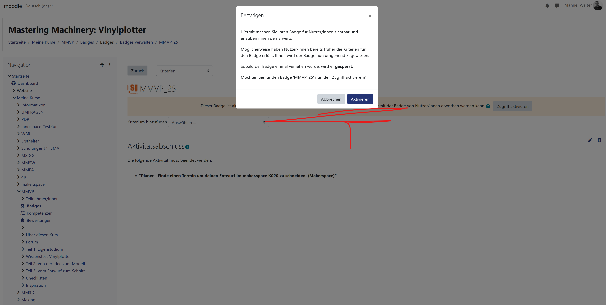

# fabman-moodle-integration

# Was es it
Fabman-Moodle-Integration ist eine Integration, die es ermöglicht, automatisiert bestimmte Moodle Benachrichtigungen zu verarbeiten und die darin enthaltenen Informationen in die maker.space Management Software FabMan zu übertragen.
Die Integration ermöglicht es 
- automatisiert FabMan-Benutzer für Studis anzulegen, wenn sie ein bestimmtes Moodle-Formular ausfüllen
- automatisiert Geräteberechtigungen in FabMan an Studis zu vergeben, wenn Sie eine Schulung in Moodle abschließen
- automatisiert PDF-Schulungszertifikat zu erstellen, wenn Sie eine Schulung in Moodle abschließen

# Warum es notwendig ist
Ab sofort werden Geräteberechtigungen, Gerätebuchungen und Anwesenheitsaufzeichnungen in der Software FabMan durchgeführt, um die Zugriffskontrolle für die Geräte und Maschinen im maker.space bestmöglich zu automatisieren. Da die Software weder die Durchführung von Geräteschulungen, noch eine Registrierung über einen Self-Service anbietet, müssen diese Sachen weiterhin über Moodle abgebildet werden.  

Es existiert kein moodleseitiges Plugin zur Integration von FabMan, genauso existiert kein FabMan-seitiges Plugin für Moodle. Das Entwickeln von eigenen Moodle-Plugins ist an der TH Mannheim nicht erlaubt, genauso wie das verwenden von Webservice-Tokens. Daher musste eine externe Integration entwickelt werden, welche das Anlegen von Benutzern in FabMan sowie das Übertragen von Berechtigungen von Moodle nach FabMan ermöglicht.

# Wie es funktioniert
Da herkömmliche Wege wie das Verwenden der Moodle-API mit Webservice Tokens oder das Implementieren eines eigenen Moodle-Plugins an der TH Mannheim durch den Moodle-Administrator nicht zugelassen wird, müssen kompliziertere Umwege genommen werden. Glücklicherweise ist die Verwendung der FabMan API ([Dokumentation](https://fabman.io/api/v1/documentation)) über ein API-Token möglich.

Bestimmte Events in Moodle erzeugen immer oder nach Aktivierung der Benachrichtigung Benachrichtigungs-Emails mit den wichtigsten Eckdaten des Events. Mit Hilfe eines IMAP-Clients lassen sich diese E-Mails automatisiert auslesen und die darin enthaltenen Daten verarbeiten und über HTTP-Anfragen an die FabMan-API in FabMan übertragen.

## Registrierung über den Moodle Kurs
Schauen wir uns zunächst die Registrierung in FabMan über den Moodle-Kurs an.
Wie bereits erwähnt lässt FabMan keine Self-Service Registrierung zu, die Nutzer müssen durch einen Administrator angelegt werden. Glücklicherweise lässt sich dies über die API abbilden, sodass wir einfach eine API-Anfrage mit einem Administratortoken ausführen können, um den Nutzer anzulegen.  

Um Missbrauch zu vermeiden, sollen sich nur genau die Studis in FabMan registrieren können, die Teilnehmer im maker.space Kurs sind und ggf. Voraussetzungen wie das Unterschreiben der Nutzungsordnung erfüllt haben. Außerdem sollen die FabMan Accounts für Studis immer auf ihre Studi-Email, um zu vermeiden, dass Studis mehrere Accounts erstellen. Zudem kann so die in der E-Mail Adresse enthaltene Matrikelnummer für die Zertifikatserstellung verwendet werden. Die Studi-Email Adresse kann aus matrikelnummer@stud.hs-mannheim.de zusammengesetzt werden, es muss also nur die Matrikelnummer der Studis erfasst werden.

Benötigt wird also eine Art Formular im Moodle Kurs, welches in irgendeiner Art eine Benachrichtigung erzeugt, welche von der Integration automatisch verarbeitet werden kann. Dazu gibt es in Moodle den "Feedback" Baustein. Ein Feld zur Erfassung der Matrikelnummer wird eingefügt. Sobald ein Studi sein "Feedback" absendet, erhält der Ersteller des Feedback-Formulars eine E-Mail, in welcher der Name des Studis steht. Außerdem ist ein Link enthalten, welcher zu einer Übersicht über die Antworten des Studis enthält. 

Das "name" Attribut des HTML-Felds, indem die Matrikelnummer steht, ist über Antworten verschiedener Studis hinweg konsistent, ändert sich allerdings mit jedem neu erstellten Feedback-Formular. Nach initialem Anlegen und jeder Änderung des Feedback Formulars muss das "name" Attribut des HTML-Felds mit der Matrikelnummer neu identifiziert und in der .env dieser Integration aktualisiert werden. 

Wenn die Integration nun im eingebundenen IMAP-Postfach eine E-Mail mit einer Benachrichtigung erhält, dass ein Studi ein Feedback-Formular zur Fabman Anmeldung ausgefüllt hat, folgt sie dem Link in der E-Mail und extrahiert via Web-Scraping (mit npm cheerio) die Matrikelnummer. So wird ein Datensatz mit Name des Studi, und E-Mail (matrikelnummer@stud.hs-mannheim.de) aufgebaut, welcher dann zur Erstellung eines FabMan-Nutzers verwendet wird. 

FabMan versendet automatisch eine E-Mail an den neuen Nutzer mit der Aufforderung, ein Passwort festzulegen und den Account einzurichten.
Tritt in diesem Prozess ein Fehler auf, wird das Teaching-Team per Mail benachrichtigt und darum gebeten, den Account von Hand anzulegen.

## Rechteübertragung und Zertifikatserstellung nach Schulungsabschluss
In FabMan lässt sich für Geräte einstellen, dass sie nur nach Abschluss einer bestimmten Schulung / Erlangung einer bestimmten Kenntnis verwendet und gebucht werden dürfen. Die Erlangung einer solchen Kenntnis wird über "Training Records" abgebildet. Absolviert ein Studi bspw. die Lasercutter Schulung und erlangt die Kenntnis über den Umgang mit dem Lasercutter, erhält er einen Training Record für den Lasercutter mit aktuellem Datum. Die Vergabe dieser Training Records kann auch über die API geschehen.Die Integration muss somit nur mitbekommen, wenn ein Studi eine Schulung abschließt. 

Die Schulungen für rote Geräte enthalten immer einen Präsenzteil, für den ein Termin im Moodle-Kurs gebucht werden muss. Kursdozenten können nach diesen Terminen in Moodle eine Bewertung für die Teilnahme vergeben welche widerspiegelt, ob die Studis teilgenommen haben oder nicht und daraus abgeleitet wird, ob die in Moodle als Aktivität interpretierte Schulung erfolgreich abgeschlossen wurde oder nicht.

Schulungen für gelbe Geräte enthalten nur einen Online-Teil in Moodle, welcher automatisch als erfolgreich abgeschlossen markiert wird.
Das erfolgreiche Abschließen von Aktivitäten in Moodle allein erzeugt keine Benachrichtigungen. Allerdings können Moodle-Badges (= Abzeichen) eingerichtet werden, welche bei erfolgreichem Abschluss bestimmter Aktivitäten automatisch an die Teilnehmer vergeben werden können. In diesen lässt sich konfigurieren, dass der Ersteller der Badges bei Vergabe des Badges per Mail benachrichtigt wird.
Erhält das IMAP-Postfach der Integration eine E-Mail über eine Badgevergabe passieren zwei Sachen:

### Rechtevergabe
Der Name der Studis und der Name des vergebenen Badges wird aus der E-Mail extrahiert. Der Studi wird mit seinem Namen in FabMan gesucht. Da die Erstellung des Accounts ebenfalls über den Moodle-Anzeigenamen geschehen ist, kann es nicht zu Problemen mit Zweitnamen oder unterschiedlichen Schreibweisen kommen. Wird der Studi gefunden, wird ihm der TrainingRecord verlieren, welcher den gleichen Namen trägt wie der Badge.
Tritt ein Fehler auf, wird das Teaching-Team per Mail benachrichtigt und darum gebeten, die Rechte manuell zu vergeben.

### Zertifikatserstellung
Der Name der Studis und der Name des vergebenen Badges wird aus der E-Mail extrahiert. Der Studi wird mit seinem Namen in FabMan gesucht. Aus dem FabMan Nutzer Datensatz wird die E-Mail Adresse extrahiert, welche die Matrikelnummer enthält. Anhand des Badgenamens wird das entsprechende Zertifikatstemplate ausgewählt. In das Template werden Name und Matrikelnummer des Studis eingesetzt und das Template wird in ein PDF umgewandelt. Abschließend wird das Zertifikat an den Studi und als Kopie an das Teaching-Team zur Nachverfolgung gesendet.
Tritt ein Fehler auf, wird das Teaching-Team per Mail benachrichtigt und darum gebeten, das Zertifikat manuell zu erstellen.

# Anforderungen an den IT-Kontext
Damit alles wie oben beschrieben funktioniert, gibt es einige Voraussetzungen. Die Menge und der Detailgrad der Voraussetzungen sind vor allem der Unflexibilität der Moodle-Administration und der daraus notwendigen zahlreichen Workarounds geschuldet.

## Mail-Postfächer
Die Integration muss Zugriff auf ein E-Mail Postfach haben, welches die oben beschriebenen Benachrichtigungen erhält. Am einfachsten ist es, wenn ein Teaching-Team Member alle benachrichtigungsrelevanten Elemente / Aktivitäten in Moodle anlegt, damit alle Benachrichtigungen in einem Postfach landen. Dafür ist eine Funktionsmailadresse (maker.space@hs-mannheim.de) eingerichtet. 
Der entsprechende Teaching-Team Member leitet alle seine Moodle-Emails an dieses Postfach weiter.

## Feedback Formular für die FabMan Anmeldung
Das Feedback Formular sollte im maker.space Kurs angelegt werden und nur verfügbar sein, wenn vorher die Aktivität zum Hochladen der Nutzungsordnung abgeschlossen wurde.
Nachfolgend befindet sich eine Schritt für Schritt Anleitung zum korrekten Anlegen des Feedback Formulars. Da die Flexibilität der Integration sehr eingeschränkt ist, bitte unbedingt alle Aktivitätsnamen etc. exakt übernehmen inkl. Groß- und Kleinschreibung.

### 1. Feedback anlegen - Allgemeines
- Der Name des Feedbacks muss exakt `FabMan Anmeldung` lauten.

### 2. Feedback anlegen - Einstellungen für Fragen und Einträge / Voraussetzungen
- Anonym ausfüllen: Ja
- Mehrfache Abgabe: Ja
- Systemnachricht bei Abgaben senden: Nein
- Automatische Nummerierung: Nein
- Als Voraussetzung definieren, dass Studi die Nutzungsordnung hochgeladen hat und eine erfolgreiche Bewertung erhalten hat. 

### 3. Feedback speichern
- Speichern und zum Kurs

### 4. Antwortfeld anlegen
- In das Feedback navigieren
- Elemente bearbeiten

### 5. Art des Antwortfelds
- Als Art der Frage `Numerische Antwort` auswählen 

### 6. Einstellungen des Antwortfelds
- Erforderlich: Ja
- Frage: Matrikelnummer
- Position: 1
- Änderungen speichern

### 7. Extraktion des Feldnamens der Matrikelnummer
1. Formular mit einer einzigartigen Nummer ausfüllen, die später über eine Suche im HTML wiedergefunden werden kann. Beispiel: 123456789
2. Auf Email warten, in der steht, dass das Formular ausgefüllt wurde
3. Auf Link (Das Feedback ist auf der Website verfügbar) in der Email klicken
4. Rechtsklick auf die Seite -> Seitenquelltext untersuchen
5. Mit Strg + F die zuvor eingegebene Nummer im Seitenquelltext suchen (z.B. 123456789)
6. `name` Attribut des HTML Tags mit der Matrikelnummer (im Screenshot gelb markiert) identifizieren und in `MATNO_FIELDNAME` Environment Variable in der .env des Servers, auf dem die Integration läuft, eintragen.

## Terminbuchungskalender für Präsenzschulungen
Pro Schulung wird im entsprechenden Moodle Kurs ein Terminbuchungskalender (Planer) angelegt. Damit alles reibungslos funktioniert, muss der Kalender entsprechend der nachfolgenden Anleitung angelegt bzw. angepasst werden. Außerdem muss die Abschlussverfolgung in den jeweiligen Kurseinstellungen aktiviert sein. 

### 0. Planereinstellungen öffnen
- Die Einstellungen der entsprechenden Planeraktivität öffnen

### 1. Bewertungen konfigurieren
- Bewertung vom Typ Punkt mit Maximalpunkte 1 konfigurieren
- Bewertungskategorie: Nicht kategorisiert
- Bestehensgrenze: 1

### 2. Abschlussbedingungen festlegen
- Abschlussbedingung hinzufügen
- Aktivität ist abgeschlossen, wenn TN eine Bewertung erhalten und damit die Bestehendgrenze erreichen

! Wenn die Überschrift Abschlussbedingungen in den Einstellungen nicht zu finden ist, ist wahrscheinlich die Abschlussverfolgung in den Kurseinstellungen noch nicht aktiviert !

## Durchführung von Präsenzschulungen
Nach Durchführung einer Präsenzschulung müssen alle Teilnehmer im jeweiligen Kalendertermin eine Bewertung erhalten, damit das entsprechende Badge vergeben wird.

### 1. Teilnehmer auswählen
- In der Übersicht über die Schulungstermine im entsprechenden Zeitslot auf den Teilnehmer klicken

### 2. Teilnehmer bewerten
- Wahrgenommen: Ja
- Bewertung: 1
- Änderungen speichern

## Badges
Pro Schulung wird im entsprechenden Moodle Kurs ein Badge angelegt. 
Badges müssen ein Mal pro Jahr neu angelegt werden. Das liegt daran, dass Maschinenberechtigungen nur ein Jahr gültig sein sollen, Badges aber nur ein einziges Mal vergeben werden können und auch nach Ablauf nicht noch einmal neu vergeben werden können. Daher werden zum 1.1. jedes Jahres alle Badges mit dem aktuellen Jahr neu angelegt, z.B. `MMLC_25`. Der Jahressuffix (`_25`) wird innerhalb der Integration ignoriert.

Damit alles reibungslos funktioniert, muss das Badge entsprechend der nachfolgenden Anleitung angelegt werden.

### 1. Badge erstellen - Navigation zu Badges

- Auf den Badges Reiter in der Seitenleiste des Kurses klicken.
- Neuen Badge anlegen klicken

### 2. Badge erstellen - Grundeinstellungen

- Der Badgename besteht aus dem Kursnamen und den letzten zwei Stellen der aktuellen Jahreszahl, getrennt durch einen Unterstrich. Der Kursname sollte keine Leerzeichen enthalten. Beispiel: Kurs `MMVP`, Jahr 2025 = `MMVP_25`.
- Beschreibung beliebig ausfüllen.
- inno.space Logo oder anderes passendes Logo als Bild auswählen.

### 3. Badge erstellen - Ablaufdatum
- Ablaufdatum: Relative Zeit, 365 Tage nach der Verleihung
- Badge anlegen

### 4. Kriterium hinzufügen - Kriterium hinzufügen
- Im Überblick über den Badge auf `Kriterium hinzufügen` klicken

### 5. Kriterium hinzufügen - Art des Kriteriums
- Im Dropdown Menü `Aktivitätsabschluss` auswählen. Damit wird das Badge bei Abschließen einer bestimmten Aktivität vergeben.

### 6. Kriterium hinzufügen - Aktivitätsabschluss und Erfüllungsbedingungen
- Bei Aktivitätsabschluss die zuvor konfigurierte Planer-Aktivität zur Buchung eines Präsenzschulungstermins anklicken
- Dieses Kriterium is erfüllt, wenn ... eine der gewählten Aktivitäten ist abgeschlossen

### 7. Mitteilung konfigurieren I
- Aus dem Dropdown Menü oben links `Mitteilung auswählen`  
(Grünes Banner kann auch gelb sein, das wird im nächsten Schritt behandelt)

### 8. Mitteilung konfigurieren II
- Ersteller/in benachrichtigen: Jederzeit
- Änderungen speichern  
(Grünes Banner kann auch gelb sein, das wird im nächsten Schritt behandelt)

### 9. Zugriff aktivieren I
- Im gelben Banner Zugriff aktivieren klicken

### 10. Zugriff aktivieren II

- Aktivieren klicken

## FabMan Schulungen
Für jedes in Moodle durch eine Schulung erhältliches Badge muss ein korrespondierender Training Course in FabMan angelegt werden. Um die Zuordnung von Badges und Training Courses zu ermöglichen, muss der Name des Training Courses exakt dem Namen des Badges ohne Jahressuffix entsprechen.  
Beispiel:  
- Badge: `MMLC_25` -> Fabman Training Course `MMLC`
- Badge: `MM3D_26` -> Fabman Training Course `MM3D`

## Zertifikatstemplates
Die templates im Ordner fabman-moodle-integration/src/templates müssen nach dem folgenden Pattern benannt sein: certificate_${BadgeBaseName}_template.docx, also z.B. `certificate_MMLC_template.docx`. Der BadgeBaseName ist der Name des Badges, welches in dem jeweiligen Schulungskurs angelegt wurde ohne den Jahressuffix. Nur so kann für jede Schulung das richtige Template ausgewählt und dementsprechend das richtige Zertifikat generiert werden.

Für das Rendering der Zertifikate wird das npm Modul [docxtemplater](https://www.npmjs.com/package/docxtemplater) verwendet. Die gerenderten docx Dateien werden dann mit [gotenberg](https://gotenberg.dev/) zu PDFs konvertiert.

# Weitere Hinweise
- Es dürfen nur Personen FabMan Accounts erhalten, **welche die Nutzungsordnung in Moodle unterschrieben hochgeladen** haben. Diese kann in FabMan leider nicht abgebildet werden.

- ggf. ist es notwendig, auch den Planer für die Präsenztermine jedes Jahr neu anzulegen, damit die Badges des neuen Jahres nicht rückwirkend für eine Schulungsteilnahme aus dem Vorjahr vergeben werden.

# Anwendung starten
- Auf einem docker-fähigen Gerät (bspw. RaspberryPi) [Docker](https://www.docker.com/) installieren.
- [git](https://git-scm.com/) installieren
- Kommandozeile öffnen
- Dieses Repository clonen `git clone https://github.com/inno-mawa/fabman-moodle-integration`
- In das Repository navigieren `cd fabman-moodle-integration`
- .env-template Datei anpassen und secrets an den entsprechenden Stellen ergänzen
- .env-template Datei in .env umbenennen
- `docker compose build` ausführen
- `docker compose up` (Ausführung im Vordergrund) oder `docker compose up -d` (Ausführung im Hintergrund) ausführen.

# Laufende Anwendung aktualisieren (Changes deployen)
- Ins Repository `fabman-moodle-integration`
- `docker compose down`
- `git pull`
- `docker compose build`
- `docker compose up -d`

# Mögliche Verbesserungen

- Infoposter / Aufsteller zur Systemumstellung am maker.space Eingang

- Abfangen, wenn ein Studi versucht sich zu registrieren, aber schon einen Account hat -> keine Nachricht an das TTeam senden, sondern dem Nutzer per Mail eine Info senden, dass er bereits einen Account hat

- Irgendwie das Plugin customforms installiert und aktiviert bekommen, damit die Formularantworten direkt in der Mail stehen können und nicht der Umweg über das WebScraping genommen werden muss